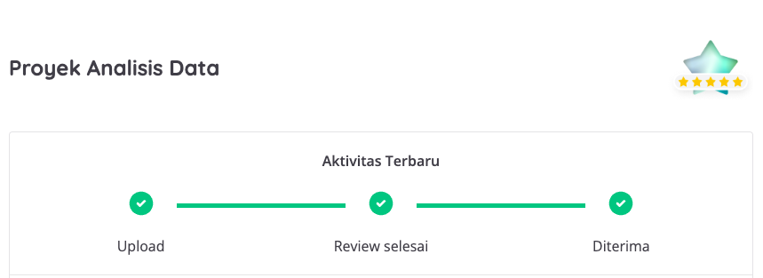
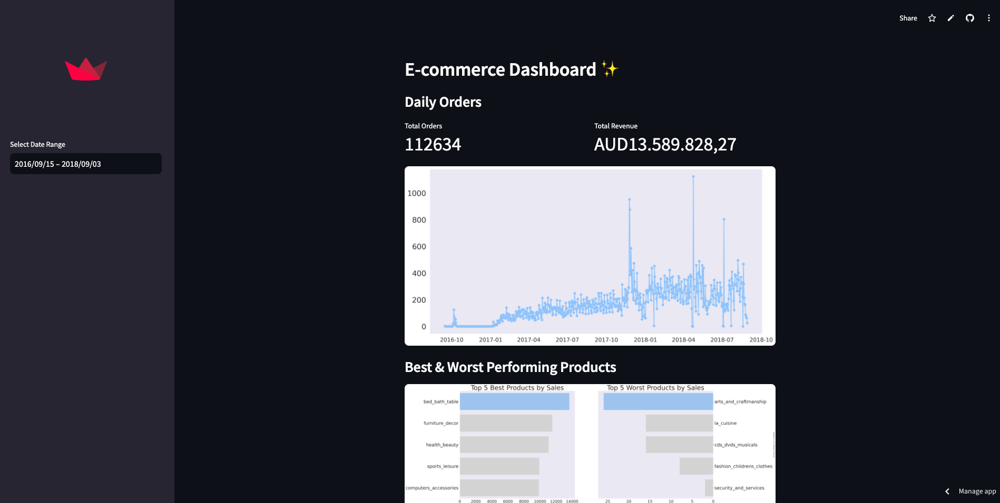

# Project Submission for Proyek Analisis Data - Dicoding

## Project Directory Structure
- **dashboard** : Streamlit dashboard for data visualization
- **data** : Data files for analysis
- **notebook** : Jupyter notebook for data analysis
## Setup Environment - Shell / Terminal
1. Make directory for project submission  
``
mkdir project-submission
``
2. Go to project submission directory  
``
cd project-submission 
``
3. Create virtual environment using pipenv  
``
pipenv install
``
4. Activate virtual environment  
``
pipenv shell
``
5. Install required packages  
``
pip install -r requirements.txt
``

## Run streamlit app
``
cd dashboard
``   
``
streamlit run dashboard.py
``

## Dashboard Preview
